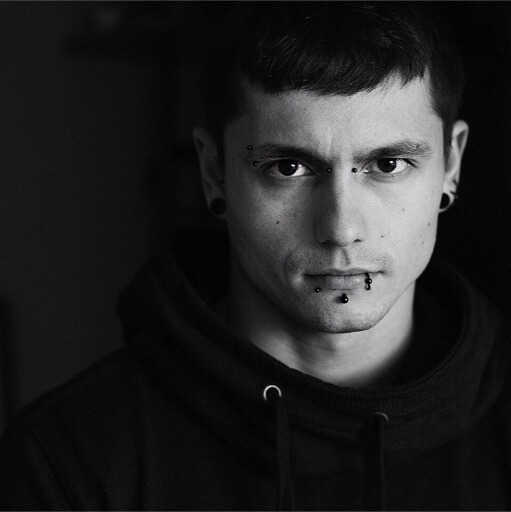

# Anton Lebedev

    

        
    

I'm a software engineer, currently based in Yerevan, Armenia 🇦🇲

I'm skilled in various web technologies and passionate about to build web-services and automation everything around mostly in PHP, Node.js and Python.

* Email: mailbox@lebster.me 
* GitHub: [github.com/thelebster](https://github.com/thelebster) 
* Site: [lebster.me](https://lebster.me)
* LinkedIn: [linkedin.com/in/lebster](https://www.linkedin.com/in/lebster/)

## Experience

### Software Engineer at [Derivative](https://www.linkedin.com/company/73797/)
Yerevan, Armenia (Contract, Remote)  
**Oct 2022 – Present**

I'm a part of the web development team and responsible for a website development, website migration to a new platform and CI/CD automation.

Skills: Amazon Web Services (AWS), PHP, Drupal, MySQL

### Software Engineer at [Slaight Music](https://www.linkedin.com/company/slaight-music/)
Saint Petersburg, Russia (Full-time, Remote)  
**Nov 2018 – Present**

I was responsible for a different websites and web services development and maintenance.

* We migrated [RockPeaks site](https://rockpeaks.com) from the Drupal 6 to the headless Drupal 8 + React.js.
* I have maintained plug-in for a Plex Media Server to integrate with a [RockPeaks site](https://rockpeaks.com) user library to fetch metadata.
* I have developed an NFT smart contracts on a FLOW blockchain and integrated with a [Dapper Wallet](https://meetdapper.com).
* I maintained AWS infrastructure to provide a CI/CD for Drupal and Next.js.
* We have migrated several Drupal 7 sites to Drupal 8/9.
* I have built several integrations with a 3rd-party service, like Plex, Youtube, Dropbox etc.

Skills: PHP, MySQL, Drupal, NodeJs, Python, React, GraphQL, Docker, Amazon Web Services (AWS)

### Chief Technology Officer at [CimpleO](https://www.linkedin.com/company/cimpleo/)
Omsk, Russia (Full-time)  
**Jun 2014 – Dec 2018**

As a CTO I was responsible for interviewing and hiring new employees. I worked on gathering project details, interpretation of business requirements into development requirements and projects estimation. I managed most of the projects and provided mentorship for the teammates.

* I led a team of 8-12 people.
* We run several projects and contributed to several Drupal modules.
* I prototyped an IoT app for iOS built on top of React Native, and built a backend based on MQTT protocol using Mosquitto (there is an [example repo](https://github.com/thelebster/example-mosquitto-simple-auth-docker) that was a setup core).

Skills: Leadership, Project Management, Mentorship, PHP, MySQL, Drupal 7/8, Node.js, Docker

### Developer at [BurningButtons](https://www.linkedin.com/company/burningbuttons/)
Omsk, Russia (Freelance)  
**2013 – May 2014**

As a full stack developer I developed websites mostly using Drupal 7 and JavaScript.

Skills: PHP, MySQL, Drupal 7, JavaScript, CSS/HTML, Node.js

### Developer at [Qliff](https://www.linkedin.com/company/qliff/)
Omsk, Russia (Full-time)  
**2010 – Aug 2013**

Web development, mostly Drupal 7.

Skills: PHP, MySQL, Drupal 6/7, JavaScript, CSS/HTML

## Education

2004 - 2009, [Omsk State Technical University (OSTU)](https://omgtu.ru/english/), Engineer's degree
